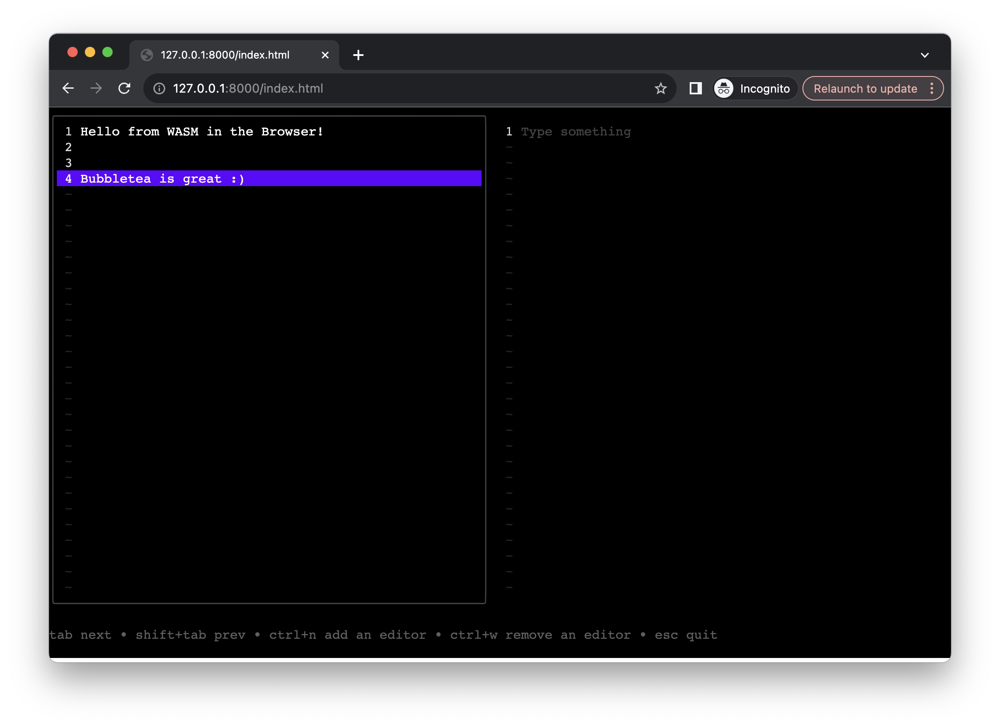

# Bubbletea in WASM

<p align="center">
  
</p>

This is a writeup on which changes to bubbletea are needed to make it work in WASM aka ``GOOS=js GOARCH=wasm go build`` and how to use it in the browser. ``main.go`` contains a working example with the bubbletea split-editor example.

## Compile Problems 

### 1. `github.com/atotto/clipboard`

As clipboard doesn't have function stubs for javascript it will fail to compile. This could simply solved by clipboard providing empty implementation for javascript. A simple solution would be to add a file `clipboard_js.go` with the following content:

**clipboard_js.go**
```go
//go:build js
// +build js

package clipboard

import (
	"errors"
)

func readAll() (string, error) {
	return "", errors.New("not implemented")
}

func writeAll(text string) error {
	return errors.New("not implemented")
}

```

In this POC I solved this by the following replace in the `go.mod` to redirect the import to a local copy of clipboard which has the file.

```
replace github.com/atotto/clipboard => ./_vendor/clipboard
```

### 2. `github.com/containerd/console`

The version of this package that bubbletea uses will not compile because again it doesn't have function stubs for javascript. This can be solved by using a newer version of the package. In this POC I solved this by the following replace in the `go.mod` to use the current head of the master branch.

```
replace github.com/containerd/console => github.com/containerd/console v1.0.4-0.20230706203907-8f6c4e4faef5
```

### 3. Bubbletea itself

We need to provide javascript empty implementations for tty and signals. This can be done by adding the following files:

**tty_js.go**
```go
//go:build js
// +build js

package tea

import (
	"errors"
	"os"
)

func (p *Program) initInput() error {
	return nil
}

func (p *Program) restoreInput() error {
	return nil
}

func openInputTTY() (*os.File, error) {
	return nil, errors.New("unavailable in js")
}
```

**signals_js.go**
```go
//go:build js
// +build js

package tea

// listenForResize is a no-op on the web.
func (p *Program) listenForResize(done chan struct{}) {
	close(done)
}
```

In this POC I solved this by the following replace in the `go.mod` to redirect the import to a local copy of bubbletea which has the file.

```
replace github.com/charmbracelet/bubbletea => ./_vendor/bubbletea
```

## Runtime Problems

Now that the code compiles we can run it but in the browser we don't have a terminal. So we need to provide one and redirect all the input / outputs. I used [xterm.js](https://xtermjs.org/) as terminal in the browser.

### 1. Redirecting input and exposing JS functions

```go
package main

import (
	"bytes"
	"fmt"
	tea "github.com/charmbracelet/bubbletea"
	"os"
	"syscall/js"
	"time"
)

type MinReadBuffer struct {
	buf *bytes.Buffer
}

// For some reason bubbletea doesn't like a Reader that will return 0 bytes instead of blocking,
// so we use this hacky workaround for now. As javascript is single threaded this should be fine
// with regard to concurrency.
func (b *MinReadBuffer) Read(p []byte) (n int, err error) {
	for b.buf.Len() == 0 {
		time.Sleep(100 * time.Millisecond)
	}
	return b.buf.Read(p)
}

func (b *MinReadBuffer) Write(p []byte) (n int, err error) {
	return b.buf.Write(p)
}

// Creates the bubbletea program and registers the necessary functions in javascript
func createTeaForJS(model tea.Model, option ...tea.ProgramOption) *tea.Program {
	// Create buffers for input and output
	fromJs := &MinReadBuffer{buf: bytes.NewBuffer(nil)}
	fromGo := bytes.NewBuffer(nil)

	prog := tea.NewProgram(model, append([]tea.ProgramOption{tea.WithInput(fromJs), tea.WithOutput(fromGo)}, option...)...)

	// Register write function in WASM
	js.Global().Set("bubbletea_write", js.FuncOf(func(this js.Value, args []js.Value) interface{} {
		fromJs.Write([]byte(args[0].String()))
		fmt.Println("Wrote to Go:", args[0].String())
		return nil
	}))

	// Register read function in WASM
	js.Global().Set("bubbletea_read", js.FuncOf(func(this js.Value, args []js.Value) interface{} {
		b := make([]byte, fromGo.Len())
		_, _ = fromGo.Read(b)
		fromGo.Reset()
		if len(b) > 0 {
			fmt.Println("Read from Go:", string(b))
		}
		return string(b)
	}))

	// Register resize function in WASM
	js.Global().Set("bubbletea_resize", js.FuncOf(func(this js.Value, args []js.Value) interface{} {
		width := args[0].Int()
		height := args[1].Int()
		prog.Send(tea.WindowSizeMsg{Width: width, Height: height})
		return nil
	}))

	return prog
}

func main() {
	// Init with some Model
	prog := createTeaForJS(newModel(), tea.WithAltScreen())

	fmt.Println("Starting program...")
	if _, err := prog.Run(); err != nil {
		fmt.Println("Error while running program:", err)
		os.Exit(1)
	}
}

```

### 2. Rendering the terminal

```html
<html>
<head>
    <meta charset="utf-8">
    <script src="https://cdn.jsdelivr.net/npm/xterm@5.3.0/lib/xterm.min.js"></script>
    <script src="https://cdn.jsdelivr.net/npm/xterm-addon-fit@0.8.0/lib/xterm-addon-fit.min.js"></script>
    <link href="https://cdn.jsdelivr.net/npm/xterm@5.3.0/css/xterm.min.css" rel="stylesheet">
    <script src="example/wasm_exec.js"></script>
    <style>
        html, body {
            height: 100%;
            margin: 0;
            padding: 0;
        }

        .terminal-container {
            /* this is important */
            overflow: hidden;
        }

        .xterm .xterm-viewport {
            /* see : https://github.com/xtermjs/xterm.js/issues/3564#issuecomment-1004417440 */
            width: initial !important;
        }
    </style>
</head>
<body>
    <div class="terminal-container" style="height: 100%; width: 100%;">
        <div id="terminal" style="height: 100%"></div>
    </div>
<script>

</script>
<script>
    function initTerminal() {
        const term = new Terminal();
        const fitAddon = new FitAddon.FitAddon();
        term.loadAddon(fitAddon);
        term.open(document.getElementById('terminal'));

        // Register terminal resize
        fitAddon.fit();
        window.addEventListener('resize', () => (fitAddon.fit()));

        // Initial resize
        bubbletea_resize(term.cols, term.rows)

        // Read from bubbletea and write to xterm
        setInterval(() => {
            const read = bubbletea_read();
            if (read && read.length > 0) {
                term.write(read);
            }
        }, 100);

        // Resize on terminal resize
        term.onResize((size) => (bubbletea_resize(term.cols, term.rows)));

        // Write xterm output to bubbletea
        term.onData((data) => (bubbletea_write(data)));
    }

    function init() {
        const go = new Go();
        WebAssembly.instantiateStreaming(fetch("./bubbletea.wasm"), go.importObject).then((result) => {
            // Run wasm
            go.run(result.instance).then(() => {
                console.log("wasm finished");
            });

            // Init terminal. This should be done after bubbletea is initialized. For now, I use a timeout.
            setTimeout(() => {
                initTerminal();
            }, 1000);
        })
    }

    init();
</script>
</body>
</html>
```

## Building

Now that everything is in place we can build the WASM file. I use the following commands to build the WASM file:

```shell
cp "$(go env GOROOT)/misc/wasm/wasm_exec.js" ./example/wasm_exec.js # Optional as this is already in the example folder
GOOS=js GOARCH=wasm go build -o example/bubbletea.wasm .
```

After that we can start a webserver in the example folder and open the `index.html` in the browser. In case you have python3 installed you can use the following commands to quickly spin up a webserver:

```shell
cd example
python3 -m http.server
```